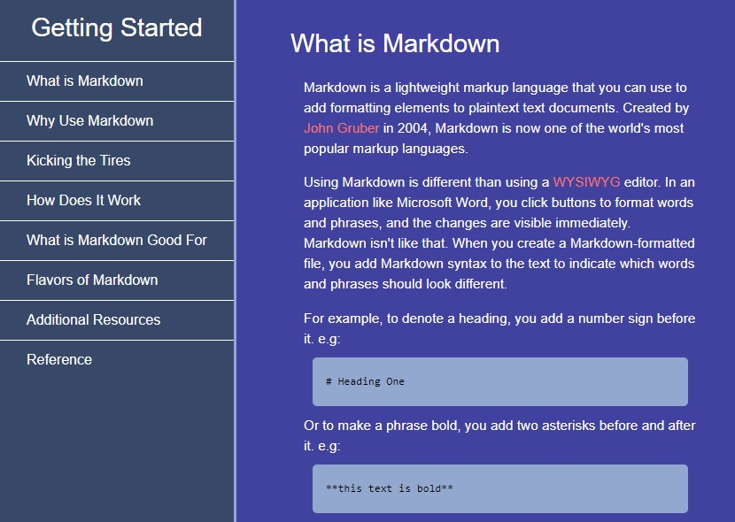

# technical-documentation-page
freeCodeCamp Responsive Web Design Certification Project
 Technical Documentation Page
 A technical documentation page to serve as instruction or reference for a topic

Browse: <https://cemcelikgh.github.io/technical-documentation-page/>

